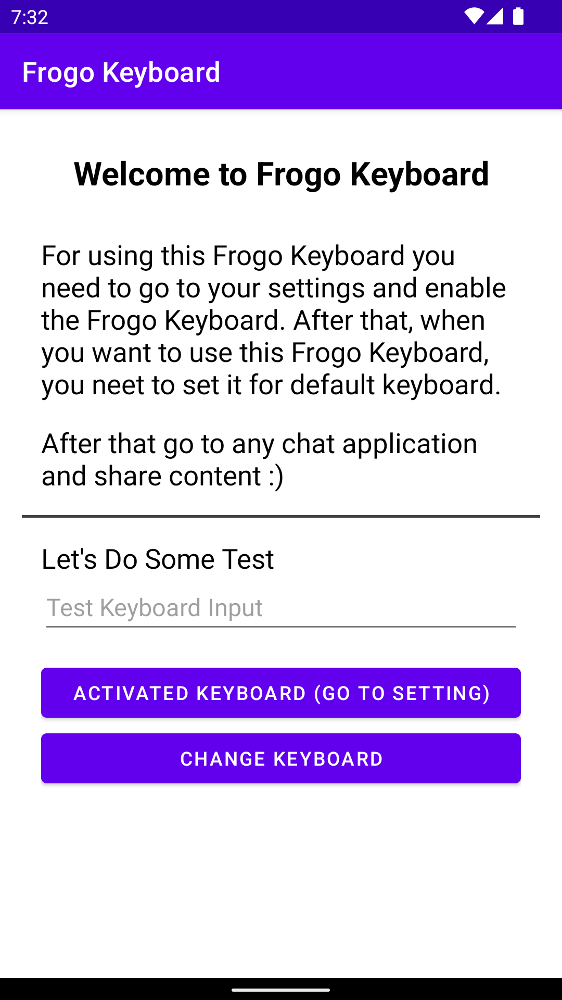
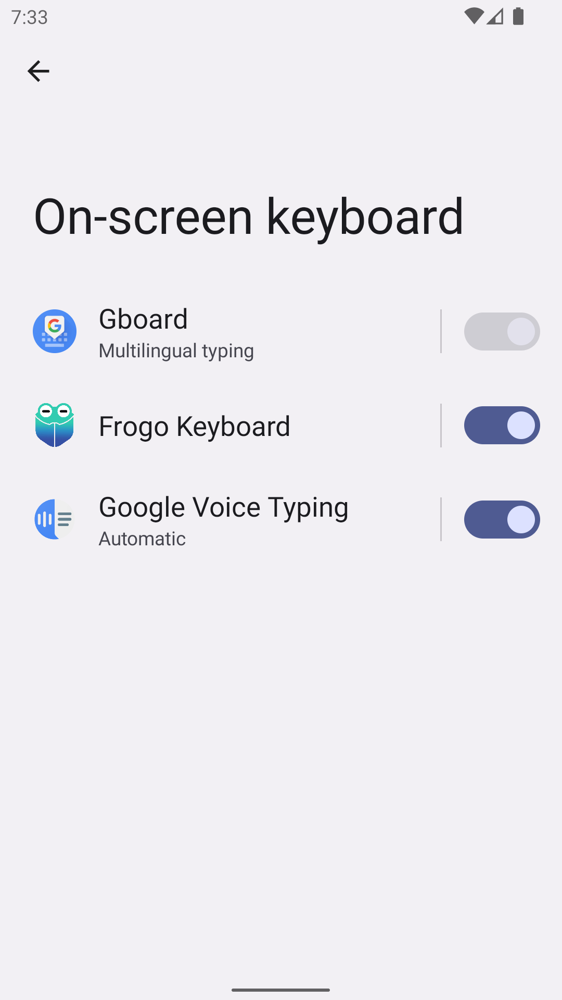
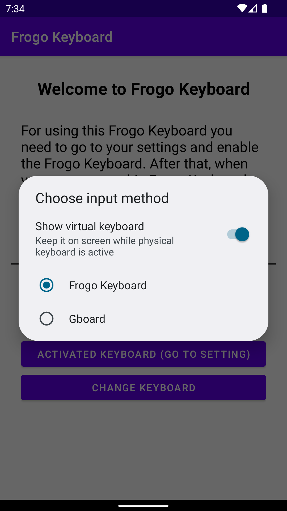
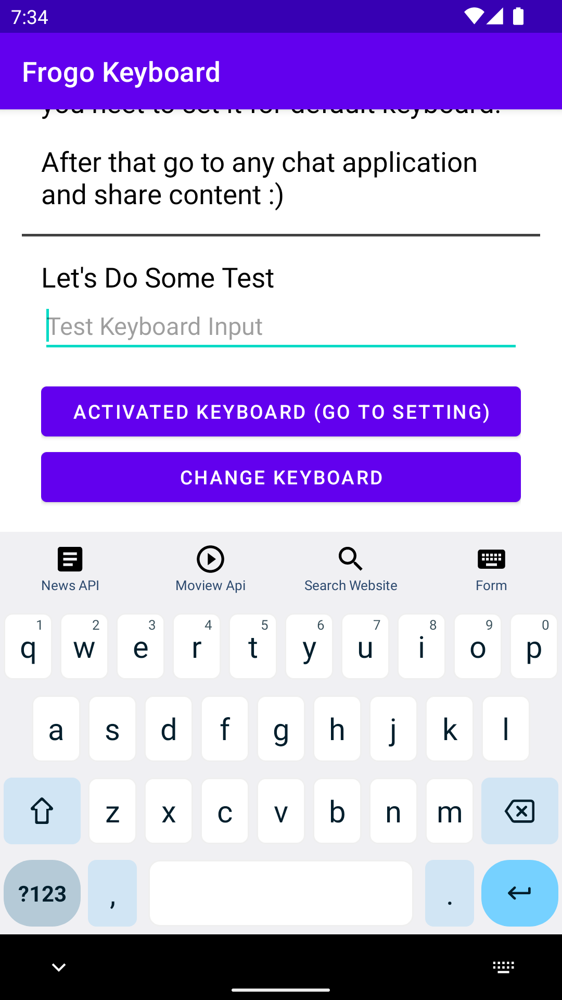
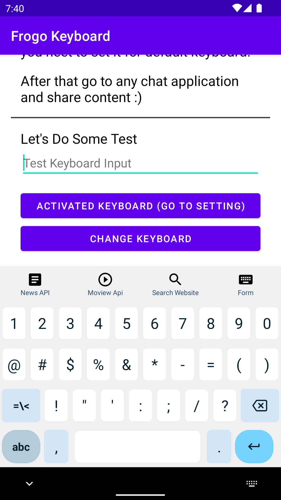
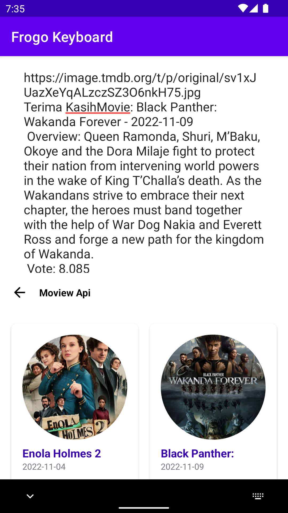
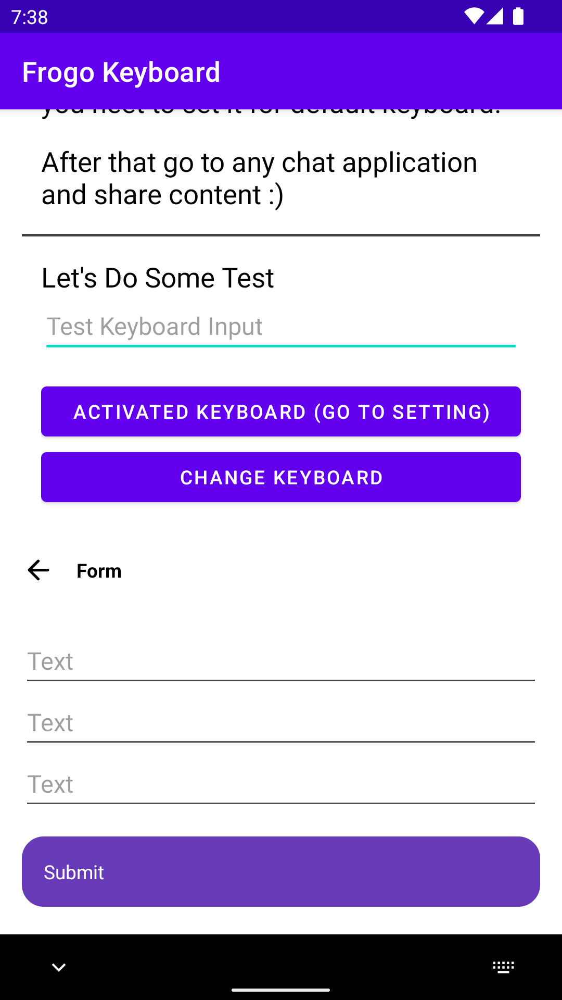
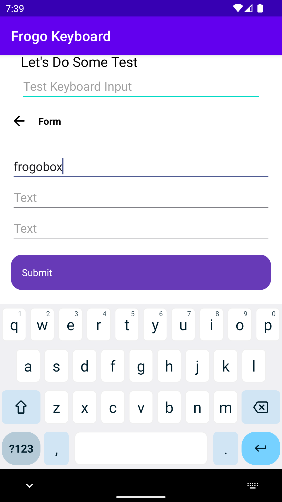
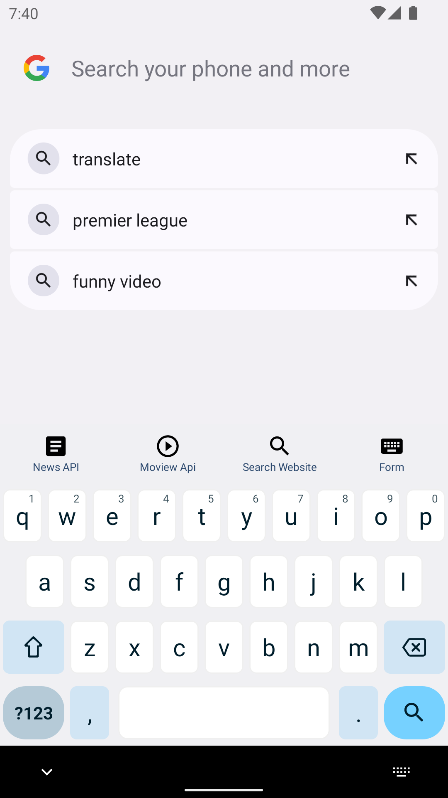

- Simple research keyboard for Android

## Screen Shoot

### How To Activated

<table>

<tr>
    <th>Welcome Page</th>
    <th>Activated Keyboard</th>
    <th>Change Keyboard</th>
</tr>

<tr>
    <td></td>
    <td></td>
    <td></td>
</tr>

</table>

### Normal Keyboard State

<table>

<tr>
    <th>Alphabet Keyboard</th>
    <th>Numeric Keyboard</th>
</tr>

<tr>
    <td></td>
    <td></td>
</tr>

</table>

### Feature Keyboard

#### Using API

<table>

<tr>
    <th>News API</th>
    <th>Movie API</th>
</tr>

<tr>
    <td></td>
    <td></td>
</tr>

</table>

#### Webview
<table>

<tr>
    <th>Show Webview</th>
    <th>Input Webview</th>
</tr>

<tr>
    <td></td>
    <td></td>
</tr>

</table>

#### Form
<table>

<tr>
    <th>Show Form</th>
    <th>Input Form</th>
    <th>Hide Keyboard</th>
</tr>

<tr>
    <td></td>
    <td></td>
    <td></td>
</tr>

</table>

### Open To Other App
<table>

<tr>
    <th>Google Search</th>
    <th>Google Message</th>
    <th>Sign In Google</th>
</tr>

<tr>
    <td></td>
    <td></td>
    <td></td>
</tr>

</table>

## Documentation
- https://github.com/SimpleMobileTools/Simple-Keyboard
- https://github.com/kolegad/custom-keyboard
- https://github.com/anssih/finqwerty
    - keymap app for phones with physical keyboards
- https://github.com/shiftrot/caps2ctrl
    - provides almost all keymaps we need usually
- https://android.googlesource.com/platform/frameworks/base/+/master/data/keyboards/Generic.kl
- https://android.googlesource.com/platform/frameworks/base/+/master/data/keyboards/Generic.kcm
- https://developer.android.com/reference/kotlin/android/hardware/input/InputManager
- https://source.android.com/devices/input/key-character-map-files

## Colaborator
Very open to anyone, I'll write your name under this, please contribute by sending an email to me

- Mail To faisalamircs@gmail.com
- Subject : Github _ [Github-Username-Account] _ [Language] _ [Repository-Name]
- Example : Github_amirisback_kotlin_admob-helper-implementation

Name Of Contribute
- Muhammad Faisal Amir
- Waiting List
- Waiting List

Waiting for your contribute

## Attention !!!
- Please enjoy and don't forget fork and give a star
- Don't Forget Follow My Github Account

